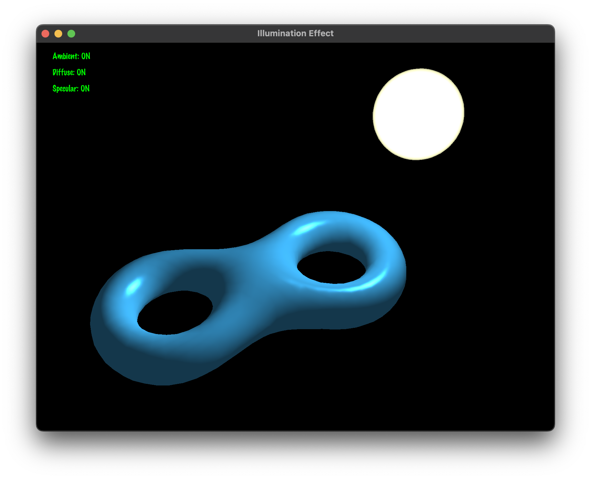

# Illumination Effect Demo

## Project Introduction

This is an OpenGL-based lighting effects demonstration program designed to showcase and help learn the basic lighting models in computer graphics. The project implements all three components of the Phong lighting model: Ambient, Diffuse, and Specular reflection, and supports two different normal calculation methods. Through interactive controls, users can intuitively understand the effects of different lighting components.



[中文文档](README_zh.md)

[Report](doc/report.md)

## Requirements

This project depends on the following libraries:

- OpenGL 3.3+
- GLEW
- GLFW3
- GLM
- FreeType

### Installing Dependencies

On Ubuntu/Debian systems:

```bash
sudo apt-get install build-essential cmake libglew-dev libglfw3-dev libglm-dev libfreetype6-dev
```

On macOS (using Homebrew):

```bash
brew install cmake glew glfw glm freetype
```

## Build Steps

1. Create and enter the build directory:

```bash
mkdir build && cd build
```

2. Generate build files:

```bash
cmake ..
```

3. Compile the project:

```bash
make
```

4. Run the program:

```bash
./illumination_effect
```

## Interaction Methods

### Control Modes
- **Shift key**: Hold Shift to enter light source control mode, release to return to camera control mode

### Lighting Controls
- **Key 1**: Toggle ambient light
- **Key 2**: Toggle diffuse reflection
- **Key 3**: Toggle specular reflection
- **Up/Down arrows**: Increase/decrease material shininess
- **N key**: Toggle normal mode (vertex normals/face normals)
- **C key**: Randomly change object color

### Camera Controls (without Shift)
- **Left mouse button drag**: Rotate camera view
- **Right mouse button drag**: Pan camera position
- **Mouse wheel**: Zoom view

### Light Source Controls (with Shift)
- **W/S keys**: Move light source along Y-axis
- **A/D keys**: Move light source along X-axis
- **Q/E keys**: Move light source along Z-axis
- **Left mouse button drag**: Rotate light source position
- **Right mouse button drag**: Pan light source position
- **Mouse wheel**: Adjust light intensity

## Interface Display

The program displays the current status of the three lighting components in the upper left corner of the interface:
- Ambient: ON/OFF (ambient light status)
- Diffuse: ON/OFF (diffuse reflection status)
- Specular: ON/OFF (specular reflection status)

Status is displayed in green when ON and red when OFF.

## File Structure

- `src/` - Source code directory
  - `main.cpp` - Main program file
  - `shader_utils.cpp` - Shader utility functions implementation
  - `text_renderer.cpp` - Text renderer implementation
- `include/` - Header files directory
  - `camera.h` - Camera class implementation
  - `model.h` - Model loading and processing
  - `light.h` - Light source class implementation
  - `shader.h` - Shader class implementation
  - `sphere.h` - Sphere class implementation
  - `text_renderer.h` - Text renderer
- `shaders/` - Shader files directory
  - `model.vs/fs` - Model shaders
  - `sphere.vs/fs` - Light source sphere shaders
  - `text.vs/fs` - Text rendering shaders
- `fonts/` - Font files directory
  - `MarkerFelt.ttc` - Font used for text rendering

## Common Issues

### Compilation Errors
If you encounter OpenGL-related compilation errors, please ensure that the correct version of OpenGL development libraries is installed on your system.

### Runtime Crashes
- If the program crashes at startup and reports missing shader files, make sure the working directory is correctly set to the project root directory.
- If it reports missing font files, check that the `fonts` directory exists and contains the necessary font files.

### Performance Issues
If rendering performance is poor, you can try:
- Reducing the window size
- Ensuring your graphics drivers are up to date
- Closing other applications that may be consuming GPU resources

## Development Notes

This project uses modern OpenGL (3.3 core profile) and shader-based rendering methods. If you need to modify or extend it, focus on:

- Shader files (to modify lighting algorithms)
- Interaction control section (to add new interactive features)
- Model loading module (to support more formats)

## Acknowledgements

This project references OpenGL-related tutorials and resources, with special thanks to:
- [LearnOpenGL](https://learnopengl.com/)
- [OpenGL-Tutorial](http://www.opengl-tutorial.org/) 