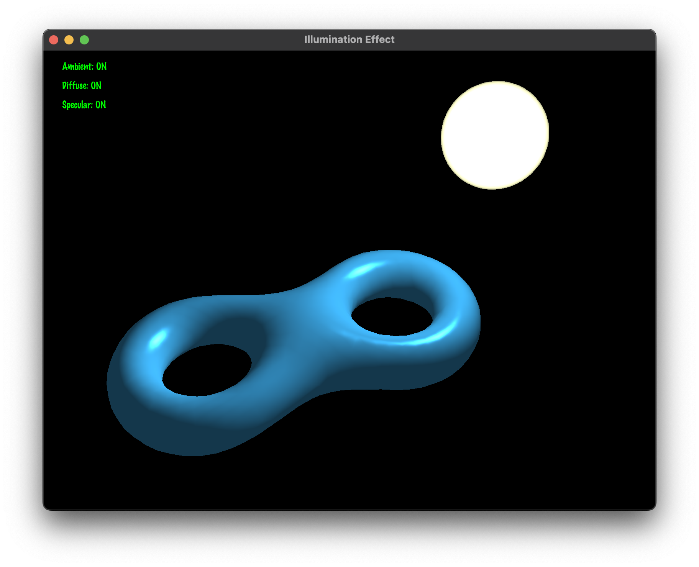

# 光照效果演示项目

## 项目介绍

这是一个基于OpenGL的光照效果演示程序，用于展示和学习计算机图形学中的基本光照模型。本项目实现了Phong光照模型的三个组成部分：环境光(Ambient)、漫反射(Diffuse)和镜面反射(Specular)，并支持两种不同的法线计算方式。通过交互式控制，用户可以直观地了解不同光照组件的效果。



[English Document](README.md)

[技术报告](doc/report_zh.md)

## 编译要求

本项目依赖以下库：

- OpenGL 3.3+
- GLEW
- GLFW3
- GLM
- FreeType

### 安装依赖库

在Ubuntu/Debian系统上：

```bash
sudo apt-get install build-essential cmake libglew-dev libglfw3-dev libglm-dev libfreetype6-dev
```

在macOS上（使用Homebrew）：

```bash
brew install cmake glew glfw glm freetype
```

## 编译步骤

1. 创建并进入构建目录：

```bash
mkdir build && cd build
```

2. 生成构建文件：

```bash
cmake ..
```

3. 编译项目：

```bash
make
```

4. 运行程序：

```bash
./illumination_effect
```

## 交互方式

### 控制模式
- **Shift键**：按住Shift进入光源控制模式，松开Shift返回相机控制模式

### 光照控制
- **1键**：开关环境光
- **2键**：开关漫反射
- **3键**：开关镜面反射
- **上/下箭头**：增加/减少材质的光泽度(shininess)
- **N键**：切换法线模式（顶点法线/面法线）
- **C键**：随机改变物体颜色

### 相机控制（非Shift模式）
- **鼠标左键拖动**：旋转相机视角
- **鼠标右键拖动**：平移相机位置
- **鼠标滚轮**：缩放视图

### 光源控制
- **W/S键**：沿Y轴移动光源
- **A/D键**：沿X轴移动光源
- **Q/E键**：沿Z轴移动光源
- **鼠标左键拖动**：旋转光源位置（按住Shift）
- **鼠标右键拖动**：平移光源位置（按住Shift）
- **鼠标滚轮**：调整光源强度（按住Shift）

## 界面显示

程序界面左上角显示当前三种光照组件的状态：
- Ambient: ON/OFF（环境光状态）
- Diffuse: ON/OFF（漫反射状态）
- Specular: ON/OFF（镜面反射状态）

状态为ON时显示绿色，OFF时显示红色。

## 文件结构

- `src/` - 源代码目录
  - `main.cpp` - 主程序文件
  - `shader_utils.cpp` - 着色器工具函数实现
  - `text_renderer.cpp` - 文本渲染器实现
- `include/` - 头文件目录
  - `camera.h` - 相机类实现
  - `model.h` - 模型加载和处理
  - `light.h` - 光源类实现
  - `shader.h` - shader类实现
  - `sphere.h` - 球体类实现
  - `text_renderer.h` - 文本渲染器
- `shaders/` - 着色器文件目录
  - `model.vs/fs` - 模型着色器
  - `sphere.vs/fs` - 光源球体着色器
  - `text.vs/fs` - 文本渲染着色器
- `fonts/` - 字体文件目录
  - `MarkerFelt.ttc` - 渲染文本使用的字体

## 常见问题

### 编译错误
如果遇到OpenGL相关的编译错误，请确保系统已安装正确版本的OpenGL开发库。

### 运行时崩溃
- 如果程序在启动时崩溃并报告找不到着色器文件，请确保工作目录正确设置为项目根目录。
- 如果报告找不到字体文件，请检查`fonts`目录是否存在并包含必要的字体文件。

### 性能问题
如果渲染性能较差，可以尝试：
- 减小窗口尺寸
- 确保显卡驱动是最新的
- 关闭其他占用GPU资源的应用

## 开发说明

本项目使用了现代OpenGL（3.3核心模式）和基于着色器的渲染方法。如需修改或扩展，重点关注：

- 着色器文件（修改光照算法）
- 交互控制部分（增加新的交互功能）
- 模型加载模块（支持更多格式）

## 致谢

本项目参考了OpenGL相关教程和资源，特别感谢：
- [LearnOpenGL](https://learnopengl.com/)
- [OpenGL-Tutorial](http://www.opengl-tutorial.org/)
